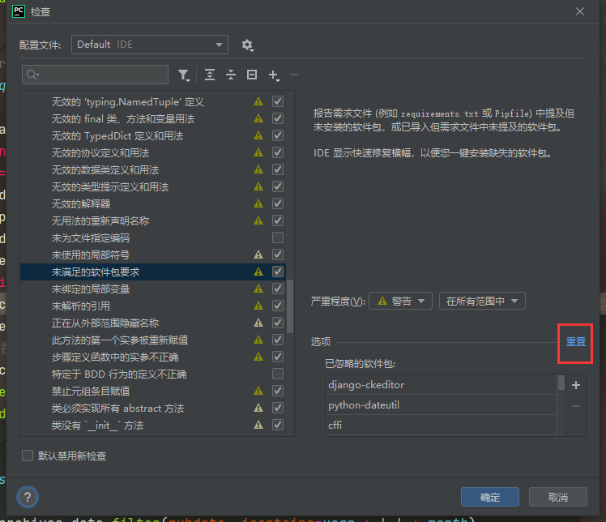

# pycharm远程配置

## 文件对齐格式化

```text
快捷键 Ctrl+Alt+L
```


## 权限设置

### 受限

```text
ii_env\Scripts\activate : 无法加载文件 F:\gitlab\AutoFrame\ii_env\Scripts\Activate.ps1，因为在此系统上禁止运行脚本。
有关详细信息，请参阅 https:/go.microsoft.com/fwlink/?LinkID=135170 中的 about_Execution_Policies。
所在位置 行:1 字符: 1

ii_env\Scripts\activate
  + CategoryInfo          : SecurityError: (:) []，PSSecurityException+ FullyQualifiedErrorId : UnauthorizedAccess
```

### 打开权限


### 代码命令:

```cmd
Get-ExecutionPolicy
Set-ExecutionPolicy Bypass
```

### 说明:

```text
以管理员身份运行PowerShell

在PowerShell里面执行命令：Get-ExecutionPolicy

输出的是：Restricted

表明当前是严格受限模式，需要设置打开，在PowerShell里面执行命令：Set-ExecutionPolicy Bypass
设置打开后，在PowerShell里面执行命令：Get-ExecutionPolicy

输出的是：Bypass

设置完成后，再次重启Pycharm，再次运行ii_env\Scripts\activate不会报错，可进入到虚拟环境
```

## 背景图


## 代码提示

### 插件:kite

## 快速导入模块


### 快捷键:

```python
alt+enter
```


## 全局引入模块


### 局部引入模块


## 提交GitHub配置


## pycharm配置


## 步骤返回


## 快速提示未导入的依赖包安装




## 修改镜像源

```py
阿里云 
http://mirrors.aliyun.com/pypi/simple/
豆瓣(douban) 
http://pypi.douban.com/simple/

```

