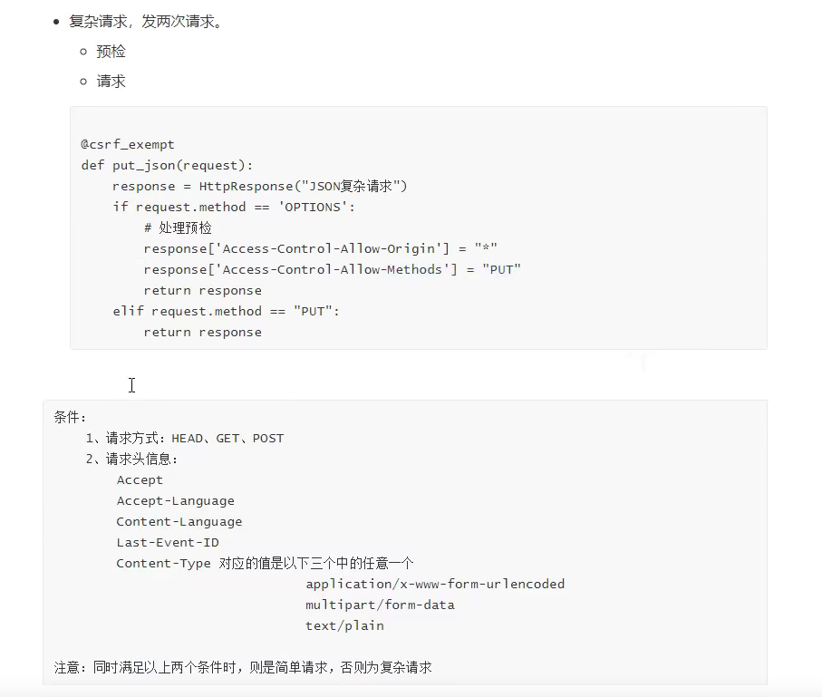

# 解决跨域问题

## 浏览器

- ### ajax

```javascript
$.ajax({
    url:"http://bengenseo.com/api/v1/article",
    type:"GET",
    data:{...},
          success:function(arg){
              console.log(arg)
          }
    })
```

- ### 具有"同源策略的限制",导致发送"ajax"请求时跨域存在,无法获取到数据

## 方式一: 返回给前端数据时(views.py)

- ### 允许所有

  - ```python
    def myview(_request): 
        response = HttpResponse(json.dumps({"key": "value","key2": "value2"})) 
        response["Access-Control-Allow-Origin"] = "*"
        response["Access-Control-Allow-Methods"] = "POST, GET, OPTIONS" 
        return response
    ```

- ### 允许指定

  - ```python
    def myview(_request): 
        response = HttpResponse(json.dumps({"key": "value","key2": "value2"})) 
        response["Access-Control-Allow-Origin"] = "http://www.bengenseo.com"
        response["Access-Control-Allow-Methods"] = "POST, GET, OPTIONS" 
        return response
    ```

## 方式二: 允许跨域

- ### 跨域组件安装

```python
pip install django-cors-headers==3.2.0
```

- ### 配置settings.py

```python
INSTALLED_APPS = [
    'corsheaders',# 跨域
]

MIDDLEWARE = [  # Or MIDDLEWARE_CLASSES on Django < 1.10
    'corsheaders.middleware.CorsMiddleware',
    'django.middleware.common.CommonMiddleware',
]

CORS_ORIGIN_WHITELIST = [# 跨域配置允许域名端口
    "https://example.com",
    "https://sub.example.com",
    "http://localhost:8080",
    "http://127.0.0.1:9000",
    r"^https://\w+\.example\.com$", # 子域名多的时候用
]

CSRF_TRUSTED_ORIGINS = [# 跨域伪造保护
    'change.allowed.com',
]

CORS_ALLOW_METHODS = [# 跨域允许请求访问
    'DELETE',
    'GET',
    'OPTIONS',
    'PATCH',
    'POST',
    'PUT',
]

CORS_ALLOW_HEADERS = [# 跨域默认 请求头
    'accept',
    'accept-encoding',
    'authorization',
    'content-type',
    'dnt',
    'origin',
    'user-agent',
    'x-csrftoken',
    'x-requested-with',
]
```

## 简单请求/复杂请求


