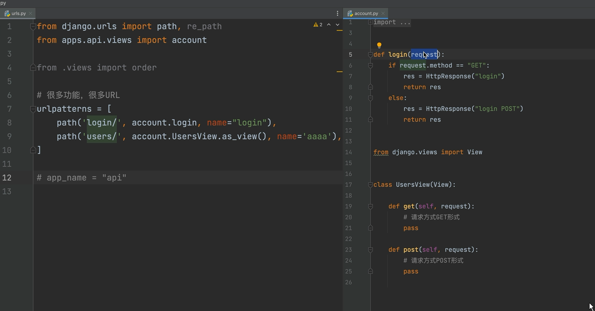
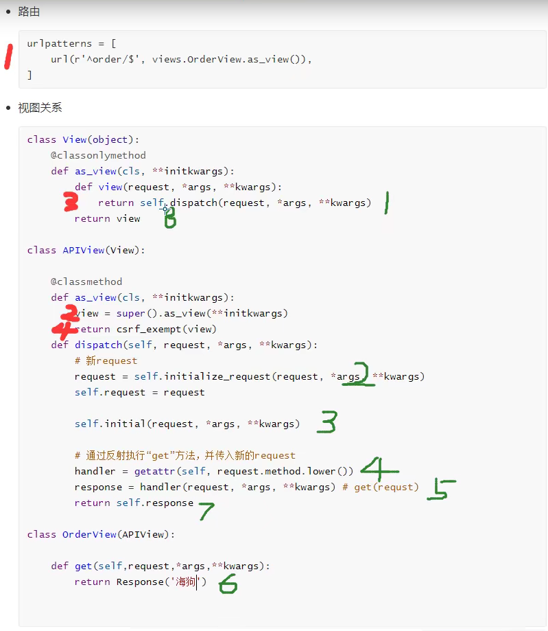

# Django视图之CBV

## 视图关系





FBV: function base view

CBV: class base view

CBV,基于反射实现,根据请求方式的不同.执行不同的方法

#### 原理:

​	a.路由

​		url -> view方法 -> dispatch方法(反射其他方法)


  ```python
  增: CreateAPIView --- POST方法
  删: DestroyAPIView --- DELETE方法
  改: UpdateAPIView --- put和patch方法
  查: ListAPIView,RetrieveAPIView --- get方法
  ```


列表生成时

```python
v = [item for item in [1,2]]
```

这时

```python
v =[1,2]
```

## 面向对象

### 封装

#### 	对同一类方法封装到类中

## 文件"增删改查"方法

```python
class File:
```

## 数据库"增删改查"方法

```python
class DB:
```


#### 将数据封装到对象中

```python
class File:
    def __init__(self,key1,key2):
        self.key1 = a1
        self.key2 = a2
obj1= File(123,456)
```

## 示例

```python
from rest_framework.generics import ListAPIView,CreateAPIView,RetrieveAPIView,UpdateAPIView,DestroyAPIView
class NameView(APIView):
    # 改
    def put(self, request, *args, **kwargs):
        return HttpResponse("PUT")
    
    # 删
    def delete(self, request, *args, **kwargs):
        return HttpResponse("DELETE")
    
    # 增
    def post(self, request, *args, **kwargs):
        return HttpResponse("POST")

    # 查
    def get(self, request, *args, **kwargs):
        return HttpResponse("GET")
```

## 基类继承

公共类继承(多个类共用的功能,为了避免重复编写)

```python
class MyBaseView(object):
    def dispatch(self,request,*args,**kwargs):
        print("Before")
        ret = super(MyBaseView,self).dispatch(request, *args, **kwargs)
        print("After")
        return ret
```

自定义类

​	优先级比较高,就把 MyBaseView 放在前面

```python
class StudentsView(MyBaseView,view):
    # 增
    def put(self, request, *args, **kwargs):
        return HttpResponse("PUT")
    
    # 删
    def delete(self, request, *args, **kwargs):
        return HttpResponse("DELETE")
    
    # 改
    def post(self, request, *args, **kwargs):
        return HttpResponse("POST")

    # 查
    def get(self, request, *args, **kwargs):
        return HttpResponse("GET")
```


