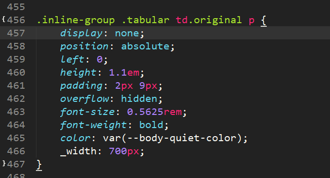

# CkEditor

## 修改Django默认后台模板BUG

- ```py
  C:\custom\GitHub\Django\day05\.venv\Lib\site-packages\django\contrib\admin\static\admin\css\foms.css
  ```

  

## 关闭标签过滤safe

```
{{ item.body|safe}}
```

## from ckeditor_uploader.views(重命名,上传路径)

### 修改文件(路径: D:\GitHub\Django\MyDjango\Lib\site-packages\ckeditor_uploader\views.py)

```python
import os,time,random
def get_upload_filename(upload_name, user):
    if getattr(settings, 'CKEDITOR_RESTRICT_BY_DATE', True):
        # 原生 date_path = datetime.now().strftime('%Y/%m/%d')
        date_path = datetime.now().strftime('%Y%m')

    if (getattr(settings, 'CKEDITOR_UPLOAD_SLUGIFY_FILENAME', True) and
            not hasattr(settings, 'CKEDITOR_FILENAME_GENERATOR')):
        # 原生 upload_name = utils.slugify_filename(upload_name)
        ext = os.path.splitext(upload_name)[1]
        # 文件目录
        d = os.path.dirname(upload_name)
        # 定义文件名，年月日时分秒随机数
        fn = str(int(time.time()))
        fn = fn + '_%d' % random.randint(0, 100)
        # 重写合成文件名
        upload_name = os.path.join(d, fn + ext)

    if hasattr(settings, 'CKEDITOR_FILENAME_GENERATOR'):
		pass
```


```shell
pip install django-ckeditor==5.4.0
pip install pillow
```

setting.py

```python
INSTALLED_APPS = [
    # 富文本编辑器
    'ckeditor',
    'ckeditor_uploader'
]

MEDIA_URL = '/uploads/'
MEDIA_ROOT = os.path.join(BASE_DIR, 'uploads') # 默认根目录
CKEDITOR_UPLOAD_PATH='allimg/'

CKEDITOR_CONFIGS = {
    'default': {
        'skin': 'moono',
        # 'skin': 'office2013',
        'toolbar_Basic': [
            ['Source', '-', 'Bold', 'Italic']
        ],
        'toolbar_YourCustomToolbarConfig': [
            {'name': 'document', 'items': ['Save', 'Preview', '-', 'Templates','Find', 'Replace']},

            {'name': 'basicstyles',
             'items': ['Bold', 'Italic', 'Underline', 'Strike', 'Subscript', 'Superscript', '-', 'RemoveFormat']},
            {'name': 'paragraph',
             'items': ['NumberedList', 'BulletedList', '-', 'Outdent', 'Indent', '-', 'Blockquote', '-',
                       'JustifyLeft', 'JustifyCenter', '-']},
            {'name': 'links', 'items': ['Link', 'Unlink', 'Anchor']},
            {'name': 'insert',
             'items': ['Image', 'Table', 'HorizontalRule', 'Smiley', 'SpecialChar']},

            {'name': 'styles', 'items': ['Styles', 'Format', 'Font', 'FontSize']},
            {'name': 'colors', 'items': ['TextColor', 'BGColor']},

            {'name': 'yourcustomtools', 'items': [
                'Preview',
                'Maximize',
            ]},
        ],
        'toolbar': 'YourCustomToolbarConfig',  # put selected toolbar config here
        # 'toolbarGroups': [{ 'name': 'document', 'groups': [ 'mode', 'document', 'doctools' ] }],
        # 'height': 291,
        # 'width': '100%',
        # 'filebrowserWindowHeight': 725,
        # 'filebrowserWindowWidth': 940,
        # 'toolbarCanCollapse': True,
        'mathJaxLib': '//cdn.mathjax.org/mathjax/2.2-latest/MathJax.js?config=TeX-AMS_HTML',
        'tabSpaces': 4,
        'extraPlugins': ','.join([
            'uploadimage', # the upload image feature
            # your extra plugins here
            'div',
            'autolink',
            'autoembed',
            'embedsemantic',
            'autogrow',
            # 'devtools',
            'widget',
            'lineutils',
            'clipboard',
            'dialog',
            'dialogui',
            'elementspath'
        ]),
    }
}


```

urls.py

```python
from django.conf import settings
from django.conf.urls.static import static
from django.contrib import admin
from django.urls import path, include

urlpatterns = [
    path('admin/', admin.site.urls),
    path('', include('edit.urls')),
    path('ckeditor/', include('ckeditor_uploader.urls')),
]
urlpatterns+= static(settings.MEDIA_URL, document_root=settings.MEDIA_ROOT)
```


models.py

```python
from django.db import models
# 不带图片上传
from ckeditor.fields import RichTextField
# 带图片上传
from ckeditor_uploader.fields import RichTextUploadingField

# Create your models here.
class MyNote(models.Model):

    content = RichTextUploadingField(config_name='default')
```


admin.py

```python
from django.contrib import admin
from .models import MyNote
# Register your models here.
admin.site.register(MyNote)
```

forms.py

```python
from django import forms
from .models import MyNote

class NoteForm(forms.ModelForm):
    class Meta:
        model = MyNote
        fields = ['title', 'content']
```


views.py

```python
from django.shortcuts import render
from .forms import NoteForm
# Create your views here.

def index(request):
    return render(request,'index.html', {'form': NoteForm()})
```

index.html

```html
<script src="/static/ckeditor/ckeditor/ckeditor-init.js"></script>
<script src="/static/ckeditor/ckeditor/ckeditor/ckeditor.js"></script>


<div class="left">
    <form method="post" action="/">
        
        {{form.as_p}}
    </form>
</div>

```

## 目录里有settings.py的urls.py(非项目里的)

```python
from django.urls import path, include
from edit import views
urlpatterns = [
    url(r'^ckeditor/',include('ckeditor_uploader.urls')),
]
```

## 代码功能

### 路径:D:\GitHub\Django\Lamps\Lib\site-packages\ckeditor\static\ckeditor\ckeditor\config.js

```js
CKEDITOR.editorConfig = function (config) {
    // Define changes to default configuration here. For example:
    // config.language = 'fr';
    // config.uiColor = '#AADC6E';
    //config.extraPlugins:"codesnippet"; // 添加 代码功能
    config.disallowedContent='img{width,height};img[width,height]';//取消图片默认宽高
};

```

### settings.py

```python

CKEDITOR_CONFIGS = {
    'default': {
         'toolbar': (
             # 代码功能
            ['Blockquote', 'CodeSnippet'],
         ),
        'extraPlugins': 'codesnippet',# 代码功能
    }
```

## 代码高亮设置

### 解压文件[highlight.zip](./assets\highlight.zip) 

### 引用js: highlight.min.js

### 引用css不同样式: styles文件夹

```html
<link rel="stylesheet" href="">
<script src=""></script>
<script>
    hljs.initHighlightingOnLoad();//代码高亮
</script>
```

## 复制按钮

### 文件  [cope.js](./assets\cope.js) 

```html
<script src=""></script>
<div id=" "  data-clipboard-target=".hljs">Copy</div>
<script>
    //复制按钮
    var btn = document.getElementById('btn');
    var clipboard = new ClipboardJS(btn);

    clipboard.on('success', function (e) {
        console.info('Action:', e.action);
        console.info('Text:', e.text);
        console.info('Trigger:', e.trigger);
    });

    clipboard.on('error', function (e) {
        console.info('Action:', e.action);
        console.info('Text:', e.text);
        console.info('Trigger:', e.trigger);
    });
</script>
```


