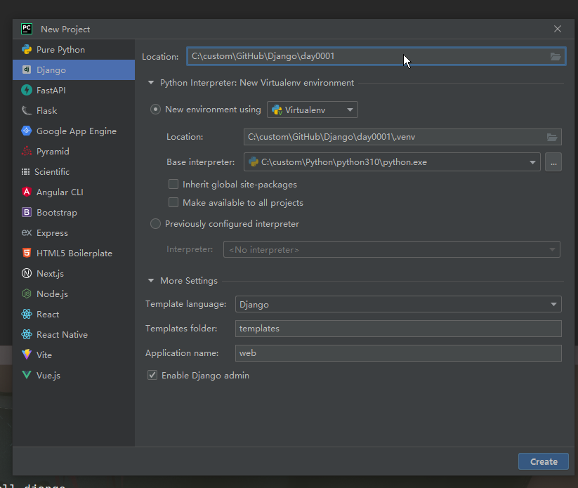
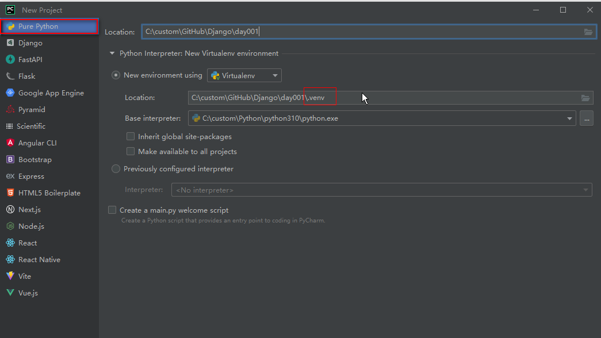
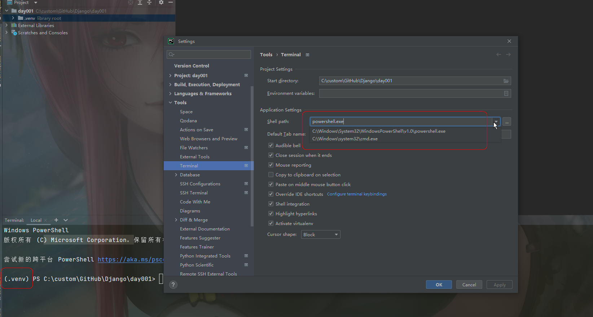
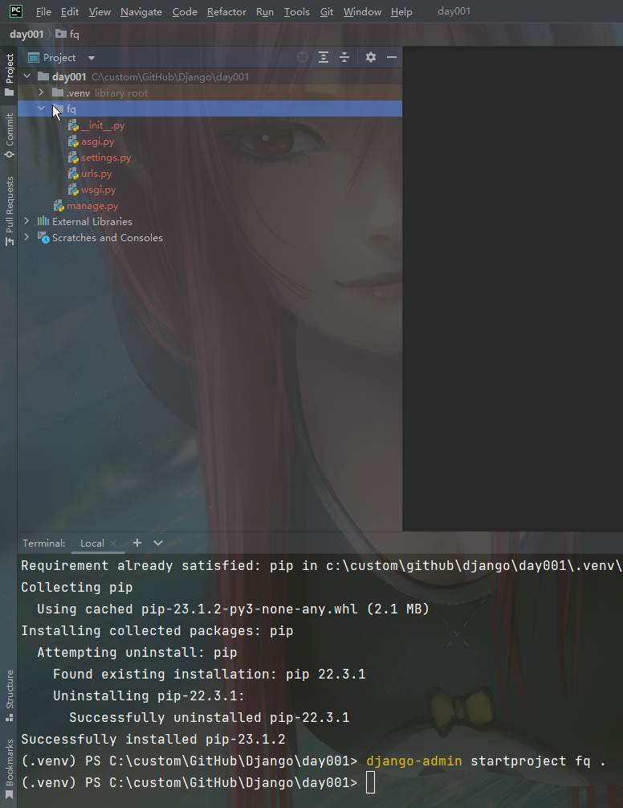
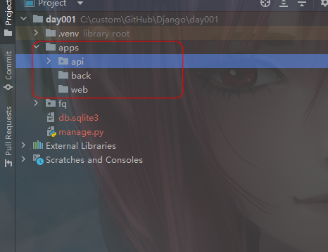
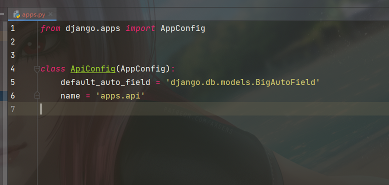
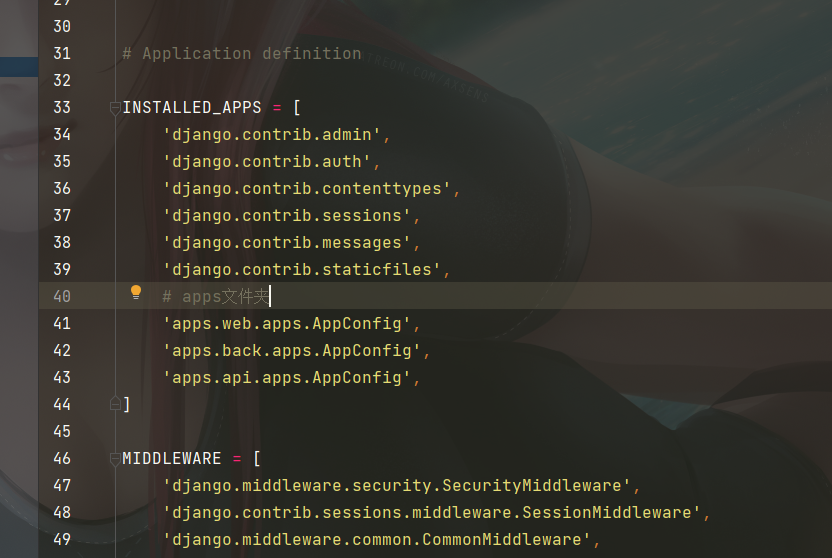

# 步骤流程

## 使用最新Django版本




# 非最新django版本流程

## 创建虚拟环境



## 激活环境

### terminal(终端)


- ### 默认启动

  - PowerShell
  - 如何启动不了虚拟环境venv
  - 则修改为cmd.exe



## 安装django

```python
pip install django
pip install django==3.2
```

## 创建Django项目

- ### 带' . '为当前目录下创建

```py
 django-admin startproject 项目名 .
django-admin startproject fq .
```




## 运行django

- 

## 创建app

- ### 单个app

```py
python manage.py startapp 名称
python manage.py startapp api
```

- ### 先创建好文件夹

  

- ### 然后运行

  ```python
  python manage.py startapp api apps/api
  ```

- ### 再修改api文件夹下的apps.py

  

- ### 最后settings.py

  - ### 添加

    ```py
    # apps文件夹
        'apps.web.apps.AppConfig',
        'apps.back.apps.AppConfig',
        'apps.api.apps.AppConfig',
    ```

    