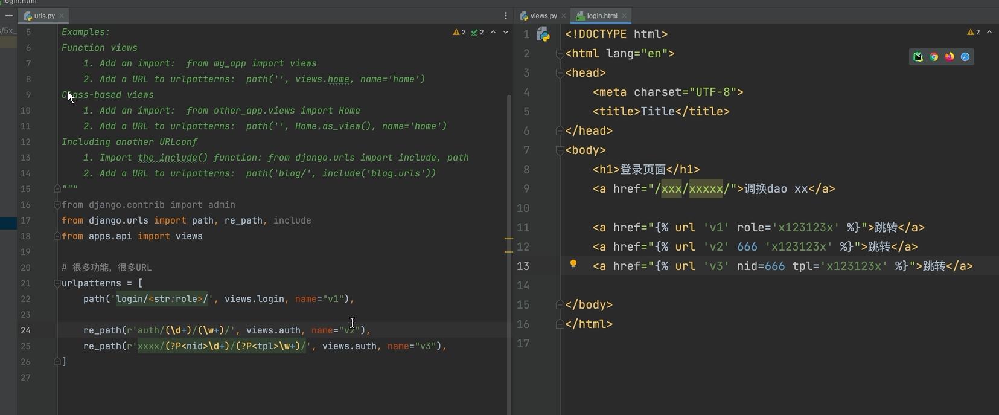
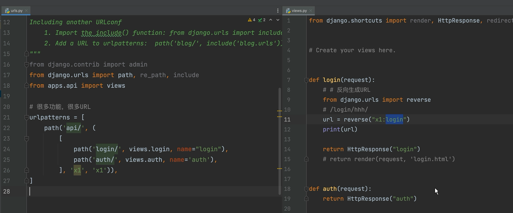
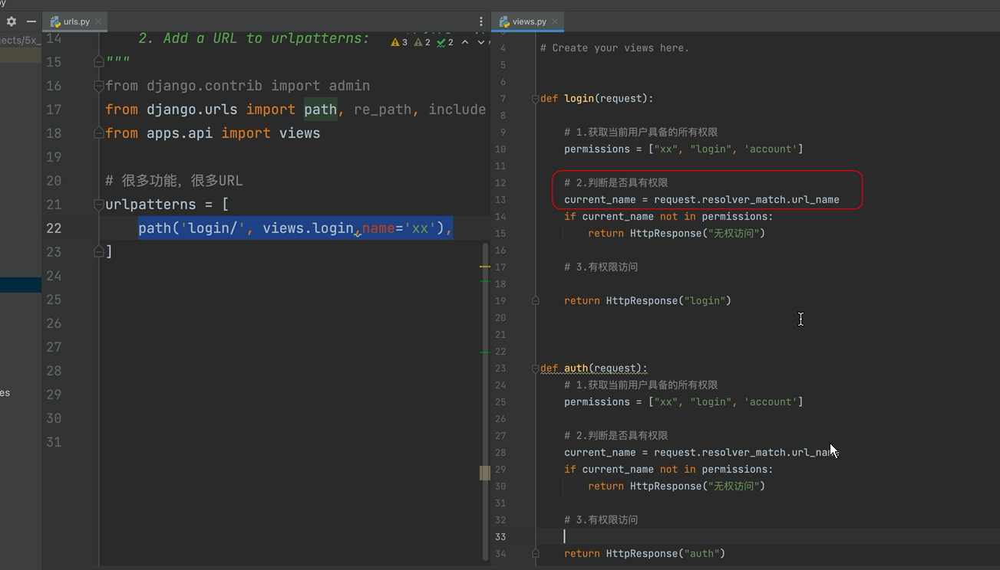

# 反向生成URL

## 根URLS.py

```py
urlpatterns = [
    path('admin/', admin.site.urls),
    path('api/', include('apps.api.urls',namespace='api'),name='api'),# namespace辅助作用,防止name重名
    path('web/', include('apps.web.urls',namespace='web'),name='web'),
    path('login/', include('apps.back.urls',namespace='login'),name='login'),
]
```

## urls.py

- ### 注意:中括号和大括号的区别

```py
from django.urls import path, re_path
from apps.back import views

app_name = 'back'
urlpatterns = [
    path('<str:add1>/', views.login_add, name='ct'),
    re_path(r'(\d+)/(\w+)/', views.login_add, name='dw')# 匿名
    re_path(r'(?P<id>\d+)/(?P<aid>\w+)/', views.login_add, name='dw')# 别名
]
```

## views.py

```py
from django.urls import reverse


def login_add(request, d,w,ct): # 传url的值
    url = reverse("back:ct", kwargs={'add1': 'aqw'}) # kwargs键值对
    url1 = reverse('back:dw', args=(11, 'adsd')) # args两个参数
     url1 = reverse('back:dw', kwargs={'id': 1,'aid':'ass'})
    # return HttpResponse('添加')
	return render(request,'login.html')
```





## 获取当前匹配对象


