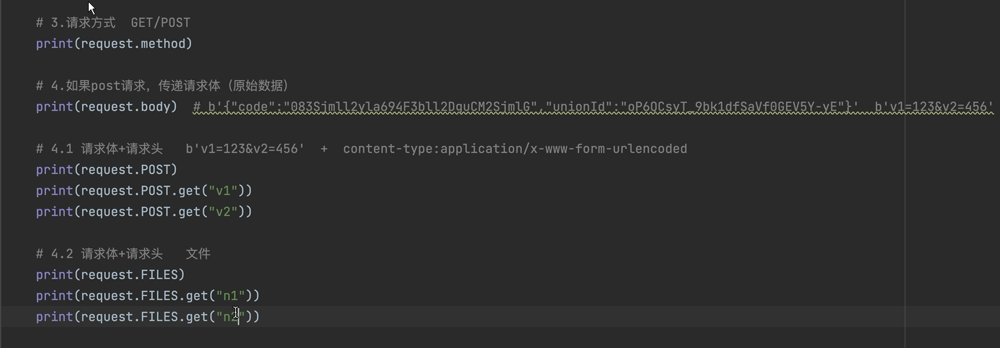

# POST和body接收数据

## POST接收数据

```py
post=request.POST
```

## body接收

```py
body=request.body
```



## cookies

```py
request.COOKIES
```

## 请求头

```py
request.headers
```


## 返回值

- ### json格式

  ```py
  from django.http import JsonResponse
  def index(request):
  	return JsonResponse()
  ```

- ### 模版渲染

  ```py
  from django.shortcuts import render
  def index(request):
  	return render(request, 'web/index.html')
  ```

- ### 重定向

  ```py
  from django.shortcuts import render, HttpResponse,redirect
  def index(request):
      # 本站栏目链接
  	# return redirect('/web/')
  	return redirect('http://bengenseo.com')
  ```

  

  

  


