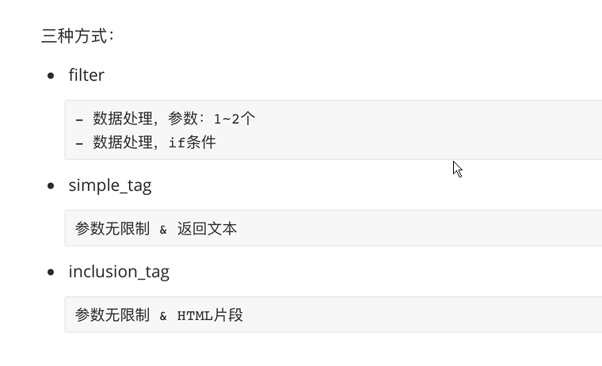
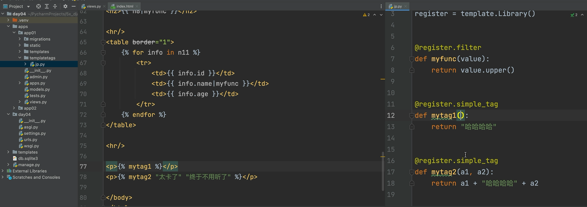
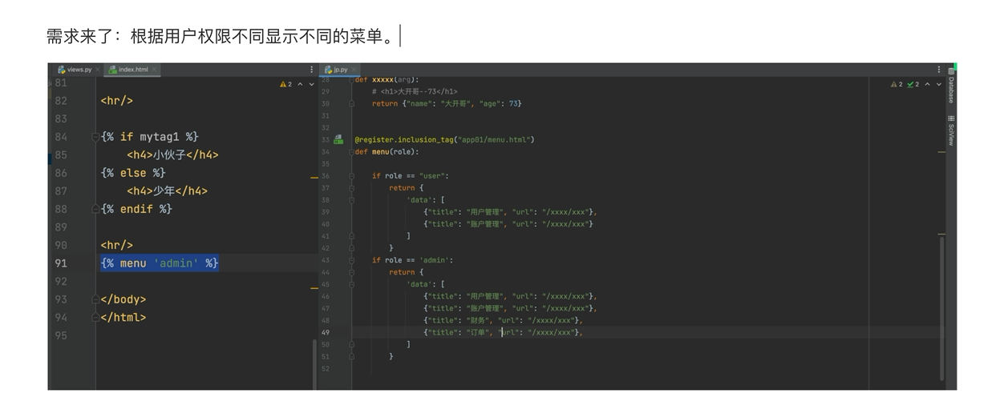

# 模板-自定义



## 模板html

```html

<!DOCTYPE html>
<html lang="en">
<head>
    <meta charset="UTF-8">
    <title>Title</title>
</head>
<body>
    <!-- 单个参数 -->
    {{name|myfunc}}
    <!-- 多个参数 -->
    
    <!-- 可加参数 -->
    
</body>
</html>
```

## python代码

```py
from django import template

register = template.Library()


# 只能传一个参数
@register.filter
def myfunc(vlue):
    return vlue.upper()

# 可传多个参数
@register.simple_tag
def mytag(a1,b1,c1):
    return 're'+a1+b1
```




## 自定义html片段

- ### python

```py
# html片段
@register.inclusion_tag('pd.html')
def pd(arg):
    return {"name":"bengen","age":18}
```

- ### html(路径:templates/pd.html)

```html
<h1>{{ name }}</h1>
{{ age }}
```

