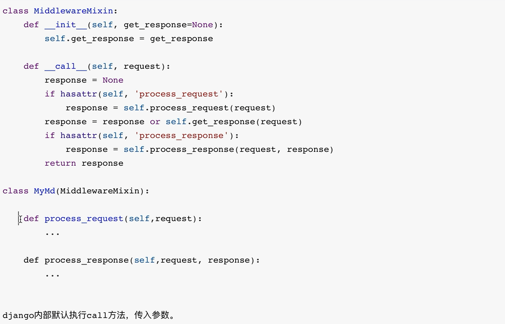

# 中间件源码流程

- ### hasattr

  - 判断是否有某个指定构造函数

    - 如:

      process_request()进入

      process_response()出去
      
      process_view()视图
      
      process_exception(self,request,exception) 视图没有返回值时,捕获视图异常