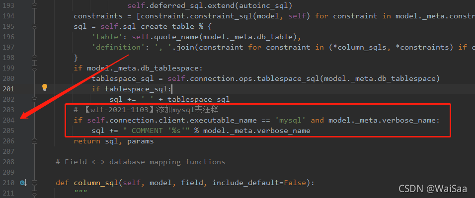
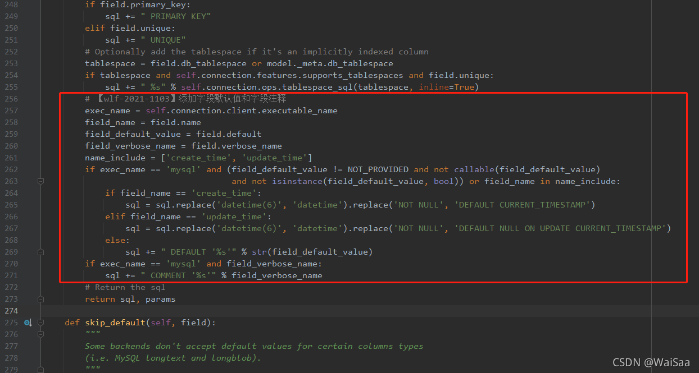

# 数据库

## 表结构不能用拼音去写字段

- ### 找到配置文件 schema.py

```text
这个文件所在的目录：{python3安装目录}/Lib\site-packages\django\db\backends\base\schema.py
\Lib\site-packages\django\db\backends\base\schema.py
```

- ### table_sql函数

```py
# 【wlf-2021-1103】添加mysql表注释
if self.connection.client.executable_name == 'mysql' and model._meta.verbose_name:
    sql += " COMMENT '%s'" % model._meta.verbose_name
```



- ### column_sql

```py
# 【wlf-2021-1103】添加字段默认值和字段注释
exec_name = self.connection.client.executable_name
field_name = field.name
field_default_value = field.default
field_verbose_name = field.verbose_name
name_include = ['create_time', 'update_time']
if exec_name == 'mysql' and (field_default_value != NOT_PROVIDED and not callable(field_default_value) 
                             and not isinstance(field_default_value, bool)) or field_name in name_include:
    if field_name == 'create_time':
        sql = sql.replace('datetime(6)', 'datetime').replace('NOT NULL', 'DEFAULT CURRENT_TIMESTAMP')
    elif field_name == 'update_time':
        sql = sql.replace('datetime(6)', 'datetime').replace('NOT NULL', 'DEFAULT NULL ON UPDATE CURRENT_TIMESTAMP')
    else:
        sql += " DEFAULT '%s'" % str(field_default_value)
if exec_name == 'mysql' and field_verbose_name:
    sql += " COMMENT '%s'" % field_verbose_name
```



## 字段

```py
SCHOOL_CHOICES = [#元祖
    (1, "男"),
    (2, "女"),
]
school = models.CharField(
    choices=SCHOOL_CHOICES,
    default=1,#默认 男
)
```

## 继承models

```py
class Info(models.Model):
    name = models.CharField(max_length=100)
    age = models.PositiveIntegerField()
 
    class Meta:
        #抽象类,该类就不能创建任何数据表
    	abstract = True
 
class Student(Info):
    # 继承info类,name/age字段就不需重写
	pass
```

## 参数

```py
# 建立索引
db_index=True
# 创建唯一
unique=True
choices=SCHOOL_CHOICES,#元祖choices=((1, "男"),(2, "女"),)
to='User', on_delete=models.CASCADE#级联删除
```

## 一对多

```py
user_id = models.ForeignKey(verbose_name='连接user表', to='User', on_delete=models.CASCADE)
```

- ### 反向查询操作(跨表则需要双斜划线)

  ```py
  xx.values('x__name')
  ```

  

- ### 有两个ForeignKey则要定义related_name

  ```py
  models.OneToOneField(verbose_name='连接user表', to='User', on_delete=models.CASCADE,related_name='d_body')
  ```

  

## 多对多

```py
user_id = models.ManyToManyField(verbose_name='连接user表', to='User')#注意:第三张表不能添加别的字段
user_id = models.ForeignKey(verbose_name='连接user表', to='User', on_delete=models.CASCADE)#在第三张表用两次ForeignKey把两张表连起来
```

## 一对一

```py
user_id = models.OneToOneField(verbose_name='连接user表', to='User', on_delete=models.CASCADE)
```

## 数据表批量添加内容

```py
models.表名.objects.bulk_create(
	objs=[models.表名(字段='内容',.....)],batch_size=一次提交数量
)
```

## 查询跨表

```py
models.表名.objects.filter(表id__name='内容').select_related('表id',...)
models.表名.objects.all().select_related('表id',...)
```


