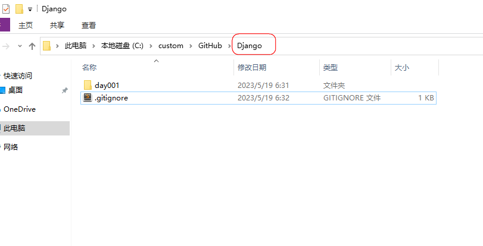

# 提交配置

## 创建文件

- GitHub项目库



- .gitignore

  ```py
  **/.gitignore
  **/.idea
  **/__pycache__
  **/local_settings.py
  **/.vscode
  ```


## 文件大小限制

在使用git push推送大文件（超过了100MB）到GitHub远程仓库时提示异常

### 全局配置

```
git config --global http.postBuffer 524288000
```

### 查看当前的Git配置

```
git config --list
```

### 或者根目录里添加文件类型

### .gitattributes

```
*.psd filter=lfs diff=lfs merge=lfs -text
*.apk filter=lfs diff=lfs merge=lfs -text
*.zip filter=lfs diff=lfs merge=lfs -text
```

