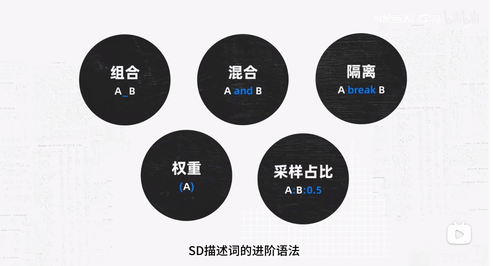
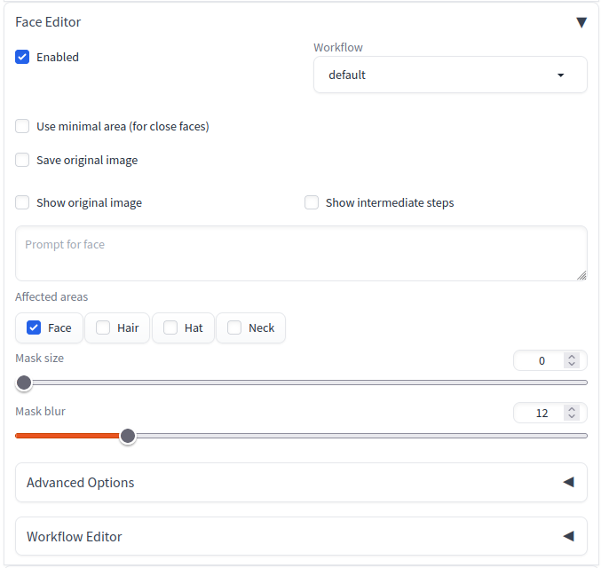

# 模型提示词




## 风格提示词

```
1. 超现实主义
 Turtle in Alice In Wonderland, surrealism
 Phantasmal Iridescent musical box
[主题]as[主题]
Bear as a space commander
Isometric Castle out of colorful flowers
3-d model, coffee shop, blue and fancy paper art
 Layered paper of wave, aesthetic, epic detail, dreamy blue color, starry night
 Isometric art of a cup of coffee,with creativity and ideas flowing, dreamy summer color palette,aestehtic, minimal design
Octopus naive art
Explode planets by Nychos
 A 3D loop fingerprint ( by WILLIAM )
 Matrix raining code, digits, spiderman
 Futuristic artificial intelligence 4k image
 Snail in a cyberpunk style created by PanzerSnail
 Blacklight volcano
 Diagramatic drawing of the structure of Tokyo Tower
 Infographic drawing of iron man suit
Wizened old female fortuneteller, head, close up character design, multiple concept designs, concept design sheet, white background, style of Yoshitaka Amano
 Stained glass window of a wolf under the moon
 Double exposure of a wolf and a mountain, natural scenery, watercolor art
 Knolling of solar system, photo realistic ( by Alizer027 )
 Game sheet of maze, floating island,3d, isometric, dreamy color palette, inspired by Pixar
 Snake game in Nokia, 16-bitMid Journey is definitely not from that generation, or it may have created a fancier user interface
2. 梦幻般的彩虹色
 Phantasmal Iridescent musical box
[主题]as[主题]
Bear as a space commander
Isometric Castle out of colorful flowers
3-d model, coffee shop, blue and fancy paper art
 Layered paper of wave, aesthetic, epic detail, dreamy blue color, starry night
 Isometric art of a cup of coffee,with creativity and ideas flowing, dreamy summer color palette,aestehtic, minimal design
Octopus naive art
Explode planets by Nychos
 A 3D loop fingerprint ( by WILLIAM )
 Matrix raining code, digits, spiderman
 Futuristic artificial intelligence 4k image
 Snail in a cyberpunk style created by PanzerSnail
 Blacklight volcano
 Diagramatic drawing of the structure of Tokyo Tower
 Infographic drawing of iron man suit
Wizened old female fortuneteller, head, close up character design, multiple concept designs, concept design sheet, white background, style of Yoshitaka Amano
 Stained glass window of a wolf under the moon
 Double exposure of a wolf and a mountain, natural scenery, watercolor art
 Knolling of solar system, photo realistic ( by Alizer027 )
 Game sheet of maze, floating island,3d, isometric, dreamy color palette, inspired by Pixar
 Snake game in Nokia, 16-bitMid Journey is definitely not from that generation, or it may have created a fancier user interface
3. A为B
[主题]as[主题]
Bear as a space commander
Isometric Castle out of colorful flowers
3-d model, coffee shop, blue and fancy paper art
 Layered paper of wave, aesthetic, epic detail, dreamy blue color, starry night
 Isometric art of a cup of coffee,with creativity and ideas flowing, dreamy summer color palette,aestehtic, minimal design
Octopus naive art
Explode planets by Nychos
 A 3D loop fingerprint ( by WILLIAM )
 Matrix raining code, digits, spiderman
 Futuristic artificial intelligence 4k image
 Snail in a cyberpunk style created by PanzerSnail
 Blacklight volcano
 Diagramatic drawing of the structure of Tokyo Tower
 Infographic drawing of iron man suit
Wizened old female fortuneteller, head, close up character design, multiple concept designs, concept design sheet, white background, style of Yoshitaka Amano
 Stained glass window of a wolf under the moon
 Double exposure of a wolf and a mountain, natural scenery, watercolor art
 Knolling of solar system, photo realistic ( by Alizer027 )
 Game sheet of maze, floating island,3d, isometric, dreamy color palette, inspired by Pixar
 Snake game in Nokia, 16-bitMid Journey is definitely not from that generation, or it may have created a fancier user interface
4. [主题] 由[材料]制成
Isometric Castle out of colorful flowers
3-d model, coffee shop, blue and fancy paper art
 Layered paper of wave, aesthetic, epic detail, dreamy blue color, starry night
 Isometric art of a cup of coffee,with creativity and ideas flowing, dreamy summer color palette,aestehtic, minimal design
Octopus naive art
Explode planets by Nychos
 A 3D loop fingerprint ( by WILLIAM )
 Matrix raining code, digits, spiderman
 Futuristic artificial intelligence 4k image
 Snail in a cyberpunk style created by PanzerSnail
 Blacklight volcano
 Diagramatic drawing of the structure of Tokyo Tower
 Infographic drawing of iron man suit
Wizened old female fortuneteller, head, close up character design, multiple concept designs, concept design sheet, white background, style of Yoshitaka Amano
 Stained glass window of a wolf under the moon
 Double exposure of a wolf and a mountain, natural scenery, watercolor art
 Knolling of solar system, photo realistic ( by Alizer027 )
 Game sheet of maze, floating island,3d, isometric, dreamy color palette, inspired by Pixar
 Snake game in Nokia, 16-bitMid Journey is definitely not from that generation, or it may have created a fancier user interface
5. 纸艺
3-d model, coffee shop, blue and fancy paper art
 Layered paper of wave, aesthetic, epic detail, dreamy blue color, starry night
 Isometric art of a cup of coffee,with creativity and ideas flowing, dreamy summer color palette,aestehtic, minimal design
Octopus naive art
Explode planets by Nychos
 A 3D loop fingerprint ( by WILLIAM )
 Matrix raining code, digits, spiderman
 Futuristic artificial intelligence 4k image
 Snail in a cyberpunk style created by PanzerSnail
 Blacklight volcano
 Diagramatic drawing of the structure of Tokyo Tower
 Infographic drawing of iron man suit
Wizened old female fortuneteller, head, close up character design, multiple concept designs, concept design sheet, white background, style of Yoshitaka Amano
 Stained glass window of a wolf under the moon
 Double exposure of a wolf and a mountain, natural scenery, watercolor art
 Knolling of solar system, photo realistic ( by Alizer027 )
 Game sheet of maze, floating island,3d, isometric, dreamy color palette, inspired by Pixar
 Snake game in Nokia, 16-bitMid Journey is definitely not from that generation, or it may have created a fancier user interface
6.分层纸
 Layered paper of wave, aesthetic, epic detail, dreamy blue color, starry night
 Isometric art of a cup of coffee,with creativity and ideas flowing, dreamy summer color palette,aestehtic, minimal design
Octopus naive art
Explode planets by Nychos
 A 3D loop fingerprint ( by WILLIAM )
 Matrix raining code, digits, spiderman
 Futuristic artificial intelligence 4k image
 Snail in a cyberpunk style created by PanzerSnail
 Blacklight volcano
 Diagramatic drawing of the structure of Tokyo Tower
 Infographic drawing of iron man suit
Wizened old female fortuneteller, head, close up character design, multiple concept designs, concept design sheet, white background, style of Yoshitaka Amano
 Stained glass window of a wolf under the moon
 Double exposure of a wolf and a mountain, natural scenery, watercolor art
 Knolling of solar system, photo realistic ( by Alizer027 )
 Game sheet of maze, floating island,3d, isometric, dreamy color palette, inspired by Pixar
 Snake game in Nokia, 16-bitMid Journey is definitely not from that generation, or it may have created a fancier user interface
7. 等距艺术
 Isometric art of a cup of coffee,with creativity and ideas flowing, dreamy summer color palette,aestehtic, minimal design
Octopus naive art
Explode planets by Nychos
 A 3D loop fingerprint ( by WILLIAM )
 Matrix raining code, digits, spiderman
 Futuristic artificial intelligence 4k image
 Snail in a cyberpunk style created by PanzerSnail
 Blacklight volcano
 Diagramatic drawing of the structure of Tokyo Tower
 Infographic drawing of iron man suit
Wizened old female fortuneteller, head, close up character design, multiple concept designs, concept design sheet, white background, style of Yoshitaka Amano
 Stained glass window of a wolf under the moon
 Double exposure of a wolf and a mountain, natural scenery, watercolor art
 Knolling of solar system, photo realistic ( by Alizer027 )
 Game sheet of maze, floating island,3d, isometric, dreamy color palette, inspired by Pixar
 Snake game in Nokia, 16-bitMid Journey is definitely not from that generation, or it may have created a fancier user interface
8.天真的艺术
Octopus naive art
Explode planets by Nychos
 A 3D loop fingerprint ( by WILLIAM )
 Matrix raining code, digits, spiderman
 Futuristic artificial intelligence 4k image
 Snail in a cyberpunk style created by PanzerSnail
 Blacklight volcano
 Diagramatic drawing of the structure of Tokyo Tower
 Infographic drawing of iron man suit
Wizened old female fortuneteller, head, close up character design, multiple concept designs, concept design sheet, white background, style of Yoshitaka Amano
 Stained glass window of a wolf under the moon
 Double exposure of a wolf and a mountain, natural scenery, watercolor art
 Knolling of solar system, photo realistic ( by Alizer027 )
 Game sheet of maze, floating island,3d, isometric, dreamy color palette, inspired by Pixar
 Snake game in Nokia, 16-bitMid Journey is definitely not from that generation, or it may have created a fancier user interface
9. 尼科斯的爆炸物体
Explode planets by Nychos
 A 3D loop fingerprint ( by WILLIAM )
 Matrix raining code, digits, spiderman
 Futuristic artificial intelligence 4k image
 Snail in a cyberpunk style created by PanzerSnail
 Blacklight volcano
 Diagramatic drawing of the structure of Tokyo Tower
 Infographic drawing of iron man suit
Wizened old female fortuneteller, head, close up character design, multiple concept designs, concept design sheet, white background, style of Yoshitaka Amano
 Stained glass window of a wolf under the moon
 Double exposure of a wolf and a mountain, natural scenery, watercolor art
 Knolling of solar system, photo realistic ( by Alizer027 )
 Game sheet of maze, floating island,3d, isometric, dreamy color palette, inspired by Pixar
 Snake game in Nokia, 16-bitMid Journey is definitely not from that generation, or it may have created a fancier user interface
10. 3D 循环
 A 3D loop fingerprint ( by WILLIAM )
 Matrix raining code, digits, spiderman
 Futuristic artificial intelligence 4k image
 Snail in a cyberpunk style created by PanzerSnail
 Blacklight volcano
 Diagramatic drawing of the structure of Tokyo Tower
 Infographic drawing of iron man suit
Wizened old female fortuneteller, head, close up character design, multiple concept designs, concept design sheet, white background, style of Yoshitaka Amano
 Stained glass window of a wolf under the moon
 Double exposure of a wolf and a mountain, natural scenery, watercolor art
 Knolling of solar system, photo realistic ( by Alizer027 )
 Game sheet of maze, floating island,3d, isometric, dreamy color palette, inspired by Pixar
 Snake game in Nokia, 16-bitMid Journey is definitely not from that generation, or it may have created a fancier user interface
11. 矩阵降雨代码
 Matrix raining code, digits, spiderman
 Futuristic artificial intelligence 4k image
 Snail in a cyberpunk style created by PanzerSnail
 Blacklight volcano
 Diagramatic drawing of the structure of Tokyo Tower
 Infographic drawing of iron man suit
Wizened old female fortuneteller, head, close up character design, multiple concept designs, concept design sheet, white background, style of Yoshitaka Amano
 Stained glass window of a wolf under the moon
 Double exposure of a wolf and a mountain, natural scenery, watercolor art
 Knolling of solar system, photo realistic ( by Alizer027 )
 Game sheet of maze, floating island,3d, isometric, dreamy color palette, inspired by Pixar
 Snake game in Nokia, 16-bitMid Journey is definitely not from that generation, or it may have created a fancier user interface
12. 未来主义
 Futuristic artificial intelligence 4k image
 Snail in a cyberpunk style created by PanzerSnail
 Blacklight volcano
 Diagramatic drawing of the structure of Tokyo Tower
 Infographic drawing of iron man suit
Wizened old female fortuneteller, head, close up character design, multiple concept designs, concept design sheet, white background, style of Yoshitaka Amano
 Stained glass window of a wolf under the moon
 Double exposure of a wolf and a mountain, natural scenery, watercolor art
 Knolling of solar system, photo realistic ( by Alizer027 )
 Game sheet of maze, floating island,3d, isometric, dreamy color palette, inspired by Pixar
 Snake game in Nokia, 16-bitMid Journey is definitely not from that generation, or it may have created a fancier user interface
13. 赛博朋克风格
 Snail in a cyberpunk style created by PanzerSnail
 Blacklight volcano
 Diagramatic drawing of the structure of Tokyo Tower
 Infographic drawing of iron man suit
Wizened old female fortuneteller, head, close up character design, multiple concept designs, concept design sheet, white background, style of Yoshitaka Amano
 Stained glass window of a wolf under the moon
 Double exposure of a wolf and a mountain, natural scenery, watercolor art
 Knolling of solar system, photo realistic ( by Alizer027 )
 Game sheet of maze, floating island,3d, isometric, dreamy color palette, inspired by Pixar
 Snake game in Nokia, 16-bitMid Journey is definitely not from that generation, or it may have created a fancier user interface
14. 黑灯瞎火
 Blacklight volcano
 Diagramatic drawing of the structure of Tokyo Tower
 Infographic drawing of iron man suit
Wizened old female fortuneteller, head, close up character design, multiple concept designs, concept design sheet, white background, style of Yoshitaka Amano
 Stained glass window of a wolf under the moon
 Double exposure of a wolf and a mountain, natural scenery, watercolor art
 Knolling of solar system, photo realistic ( by Alizer027 )
 Game sheet of maze, floating island,3d, isometric, dreamy color palette, inspired by Pixar
 Snake game in Nokia, 16-bitMid Journey is definitely not from that generation, or it may have created a fancier user interface
15. 图示性绘图
 Diagramatic drawing of the structure of Tokyo Tower
 Infographic drawing of iron man suit
Wizened old female fortuneteller, head, close up character design, multiple concept designs, concept design sheet, white background, style of Yoshitaka Amano
 Stained glass window of a wolf under the moon
 Double exposure of a wolf and a mountain, natural scenery, watercolor art
 Knolling of solar system, photo realistic ( by Alizer027 )
 Game sheet of maze, floating island,3d, isometric, dreamy color palette, inspired by Pixar
 Snake game in Nokia, 16-bitMid Journey is definitely not from that generation, or it may have created a fancier user interface
16. 信息图画
 Infographic drawing of iron man suit
Wizened old female fortuneteller, head, close up character design, multiple concept designs, concept design sheet, white background, style of Yoshitaka Amano
 Stained glass window of a wolf under the moon
 Double exposure of a wolf and a mountain, natural scenery, watercolor art
 Knolling of solar system, photo realistic ( by Alizer027 )
 Game sheet of maze, floating island,3d, isometric, dreamy color palette, inspired by Pixar
 Snake game in Nokia, 16-bitMid Journey is definitely not from that generation, or it may have created a fancier user interface
17. 角色概念设计表
Wizened old female fortuneteller, head, close up character design, multiple concept designs, concept design sheet, white background, style of Yoshitaka Amano
 Stained glass window of a wolf under the moon
 Double exposure of a wolf and a mountain, natural scenery, watercolor art
 Knolling of solar system, photo realistic ( by Alizer027 )
 Game sheet of maze, floating island,3d, isometric, dreamy color palette, inspired by Pixar
 Snake game in Nokia, 16-bitMid Journey is definitely not from that generation, or it may have created a fancier user interface
18. 彩色玻璃窗
 Stained glass window of a wolf under the moon
 Double exposure of a wolf and a mountain, natural scenery, watercolor art
 Knolling of solar system, photo realistic ( by Alizer027 )
 Game sheet of maze, floating island,3d, isometric, dreamy color palette, inspired by Pixar
 Snake game in Nokia, 16-bitMid Journey is definitely not from that generation, or it may have created a fancier user interface
19. 双重曝光
 Double exposure of a wolf and a mountain, natural scenery, watercolor art
 Knolling of solar system, photo realistic ( by Alizer027 )
 Game sheet of maze, floating island,3d, isometric, dreamy color palette, inspired by Pixar
 Snake game in Nokia, 16-bitMid Journey is definitely not from that generation, or it may have created a fancier user interface
20. 克诺林
 Knolling of solar system, photo realistic ( by Alizer027 )
 Game sheet of maze, floating island,3d, isometric, dreamy color palette, inspired by Pixar
 Snake game in Nokia, 16-bitMid Journey is definitely not from that generation, or it may have created a fancier user interface
21. 游戏表
 Game sheet of maze, floating island,3d, isometric, dreamy color palette, inspired by Pixar
 Snake game in Nokia, 16-bitMid Journey is definitely not from that generation, or it may have created a fancier user interface
22. 8-bit像素艺术，16-bit像素艺术
 Snake game in Nokia, 16-bitMid Journey is definitely not from that generation, or it may have created a fancier user interface
```


## 万恶提示词

```
NSFW,
```

### 反向词

```
【Ⅰ】
extra fingers,fewer fingers,(low quality, worst quality:1.4), (bad anatomy), (inaccurate limb:1.2),bad composition, inaccurate eyes, extra digit,fewer digits,(extra arms:1.2),
多余手指，少指，（低质量，最差质量：1.4），（解剖结构不良），（肢体不准确：1.2），构图不好，眼睛不准确，多出手指，少指，（多臂：1.2），


【Ⅱ】
lowres, bad anatomy, bad hands, text, error, missing fingers,extra digit, fewer digits, cropped, worst quality, low quality,normal quality, jpeg artifacts, signature, ,, username,blurry, bad feet
低分辨率， 解剖结构不良， 坏手， 文本， 错误， 手指缺失， 额外的数字， 更少的数字， 裁剪， 最差的质量， 低质量， 正常质量， JPEG伪影， 签名， 水印， 用户名，模糊，脚不好


【Ⅲ】
(EasyNegative:1.1),ng_deepnegative_v1_75t,bad-hands-5,lowres, bad anatomy, bad hands, text, error, missing fingers, extra digit, fewer digits, cropped, worst quality, low quality, normal quality, jpeg artifacts, signature, watermark, username, blurry
模型（EasyNegative：1.1），模型ng_deepnegative_v1_75t，坏手-5，低分辨率，解剖学不良，坏手，文本，错误，手指缺失，额外的数字，更少的数字，裁剪，最差的质量，低质量，正常质量，jpeg伪影，签名，水印，用户名，模糊


【Ⅳ】
paintings, sketches, (worst quality:2), (low quality:2), (normal quality:2), lowres, normal quality, ((monochrome)), ((grayscale)), skin blemishes, age spot, glans, extra fingers, fewer fingers, multiple hands, multiple heads, Multiple arms, disabled body, illustration, 3d, sepia, painting, cartoons, sketch, bad anatomy, bad hands, collapsed eyeshadow, multiple eyebrows, pink hair, holes on breasts, stretched nipples, analog, analogphoto, signature, logo, facing away, looking away,(fat:1.2), glans,((watermark:2)),((white letters:1)), age spot, multiple eyebrows, fleckles, stretched nipples, nipples on buttocks, analog, analog photo, 2 faces, hat, bad composition, error hands, error fingers, dark, (thick eyebrows:1.2), 2girls, (((duplicate))), mutated hands,(((((fused fingers))))), (((((too many fingers))))),signature, watermark, username, blurry, artist name, text, chromatic aberration, flat color, flat shading, retro style,, low res, bad face, missing fingers, extra digit, fewer digits, multiple legs, malformation 
绘画， 素描， （最差质量：2）， （低质量：2）， （正常质量：2）， 低分辨率， 正常质量， （（单色））， （（灰度））， 皮肤瑕疵， 老年斑，， 多余的手指， 更少的手指， 多手， 多头， 多臂， 残疾的身体， 插图， 3d， 棕褐色， 绘画， 卡通片， 素描， 解剖学不好， 坏手， 塌陷的眼影， 多眉毛， 粉红色的头发， 乳房上的洞， 拉伸的， 模拟， 模拟照片， 签名， 标志， 背对， 移开视线，（脂肪：1.2），，（水印：2）），（（白色字母：1））， 老年斑， 多眉毛， 斑点，拉伸， 臀部， 模拟， 模拟照片， 2 张脸， 帽子， 构图不好， 错误的手， 错误的手指， 深色， （厚眉毛：1.2）， 2女孩， （（（重复）））， 变异的手，（（融合的手指））， （（（手指太多）））））， 签名， 水印， 用户名， 模糊， 艺术家姓名， 文本， 色差，平面颜色，平面阴影，复古风格，，低分辨率，坏脸，手指缺失，多指、少指、多条腿、畸形


【Ⅴ】
EasyNegative,paintings,sketches,(worst quality:2),(low quality:2),(normal quality:2),((monochrome)),((grayscale)),skin spots,acnes,skin blemishes,age spot,glans,fewer fingers,((watermark:2)),((multi nipples),bad anatomy,bad hands,text,error,missing fingers,extra digit,fewer digits,cropped,jpeg artifacts,signature,username,bad feet,{Multiple people},bad anatomy,bad hands,cropped,blurry,poorly drawn hands,poorly drawn face,mutation,deformed,extra fingers,extra limbs,extra arms,extra legs,malformed limbs,fused fingers,too many fingers,long neck,cross-eyed,mutated hands,bad body,bad proportions,gross proportions,missing fingers,missing arms,missing legs,
复合负向提示词EasyNegative，画，草图（最差质量：2），（低质量：2），（正常质量：2（（灰度）），皮肤斑点，皮肤瑕疵，老年斑，更少的手指（白字：1），（多个），解剖不良，坏手，发短信错误手指缺失，额外的数字，更少的数字，裁剪JPEG伪影，签名，用户名，坏脚，{多人}，解剖不良，坏手，裁剪，模糊，手画得不好，脸部画得不好，突变，变形多余的手指，额外的四肢，额外的手臂，额外的腿，肢体畸形，融合的手指，手指太多，长颈，斜视的变异的手，极性低分辨率，身体不好，比例不好，总比例，缺少手臂，缺少腿
```

### 正向词

```
【Ⅰ】
(8k, best quality, masterpiece:1.2), (realistic, photo-realistic:1.37),best quality,masterpiece,unity,an extremely delicate and beautiful,extremely detailed,Amazing,finely detail,masterpiece,best quality,incredibly absurdres,huge filesize,ultra-detailed,highres,extremely detailed,beautiful detailed girl,extremely detailed eyes and face,beautiful detailed eyes,light on face
（8k，最佳质量，杰作：1.2），（逼真，照片级逼真：1.37），最佳质量，杰作，统一，极其精致美丽，极其详细，惊人，精细细节，杰作，最佳质量，令人难以置信的荒谬，巨大的文件大小，超详细，高分辨率，非常详细，美丽细致的女孩，极其详细的眼睛和脸，美丽的细节眼睛，脸上的光

【Ⅱ】
1girl, solo,(masterpiece,best quality,ultra-detailed, highres, extremely detailed,ntricate detail)
1女孩， 独奏，（杰作，最佳质量，超详细，高分辨率，极其详细，复杂细节）


【Ⅲ】
Photo_Comparison, 1girl, breast, standing, white shirt, phone, cellphone, smartphone, holding, sex, vaginal, picture
照片对比，1女孩， 乳房， 站立， 白衬衫， 电话， 手机， 智能手机， 持有，， 阴道， 图片

【Ⅳ】
1girl face ,Curly blue hair，Delicate and perfect face, beautiful face,Happy smile,side face,Lateral face,( best aesthetic, best quality, masterpiece, extremely detailed:1.2,extremely detailed CG unity 8k wallpaper)
一个女孩的脸，卷曲的蓝色头发。精致完美的面容，美丽的笑容，侧脸，侧面。最佳美学，最高质量，杰作，极其详细：1.2，极其详细的CG Unity 8K壁纸。

【Ⅴ】
(RAW photo, best quality),(realistic, photo-realistic:1.5),masterpiece,an extremely delicate and beautiful,extremely detailed,CG,unity,8k wallpaper,Amazing,finely detail,ultra-detailed,highres,extremely detailed,extremely detailed eyes and face,
------------------
((beautiful sky)),(((beautiful photo background))),in the city,
------------------
(brown hair:1.5),(asymmetrical bangs:1.3),swept bangs,(medium hair:1.8),hair flaps,(bobcut:1.5),(((white sweater and skinny jeans))),medium breasts,
------------------
(smile, thin eyebrows:1.5),(black eyes:1.5)
------------------
beautiful detailed girl,japanese girl,light on face,looking at viewer,staring,petite,longeyelashes,1girl,earing,windy,soft light,night view,((full body shot)),
------------------
<lora:KoreanDollLikeness:0.1>,<lora:JapaneseDollLikeness:0.4>,(ulzzang-6500:0.3)
（原始照片，最佳质量），（逼真，照片级逼真：1.5），杰作一个极其精致美丽的，非常详细，CG，统一8k壁纸，超细致，高分辨率，非常详细，极其细致的眼睛和脸部，
------------------
（（美丽的天空）），（（（美丽的照片背景））），在城市里，
------------------
（棕色头发：1.5），（不对称刘海：1.3），扫刘海，（中毛：1.8），毛瓣，（波切：1.5），（（（白色毛衣和紧身牛仔裤））），中等乳房，
------------------
（微笑，细眉毛：1.5），（黑眼睛：1.5）
------------------
美丽细致的女孩，日本女孩，脸上的光，看着观众，凝视，娇小，长睫毛，1女孩，䔺，风，柔光，夜景（（全身镜头）），
------------------
<萝拉：韩国娃娃相似度：0.1>，<萝拉：日本娃娃相似度：0.4>，（乌尔藏-6500：0.3）
```

## 1.5D-3Guofeng3_v32

### 正向词

```
best quality, masterpiece, highres, 1girl,china dress,Beautiful face
```

```
Beautiful face,
hair ornament, solo,looking at viewer,smile,closed mouth,lips
china dress,dress,hair ornament, necklace, jewelry, long hair, earrings, chinese clothes,
architecture,east asian architecture,building,outdoors,rooftop,city,cityscape
```

### 反向词

```
NSFW, lowres,bad anatomy,bad hands, text, error, missing fingers,extra digit, fewer digits, cropped, worstquality, low quality, normal quality,jpegartifacts,signature, watermark, username,blurry,bad feet
```

```
(((simple background))),monochrome ,lowres, bad anatomy, bad hands, text, error, missing fingers, extra digit, fewer digits, cropped, worst quality, low quality, normal quality, jpeg artifacts, signature, watermark, username, blurry, lowres, bad anatomy, bad hands, text, error, extra digit, fewer digits, cropped, worst quality, low quality, normal quality, jpeg artifacts, signature, watermark, username, blurry, ugly,pregnant,vore,duplicate,morbid,mut ilated,tran nsexual, hermaphrodite,long neck,mutated hands,poorly drawn hands,poorly drawn face,mutation,deformed,blurry,bad anatomy,bad proportions,malformed limbs,extra limbs,cloned face,disfigured,gross proportions, (((missing arms))),(((missing legs))), (((extra arms))),(((extra legs))),pubic hair, plump,bad legs,error legs,username,blurry,bad feet
```

### 基本设置

采样步数：30或50

采样器：DPM++ SDE Karras

VAE：vae-ft-mse-840000

### 脸部修复设置




### 或者脸部崩坏建议删除full body关键词

## 1.5D-anyorangemixAnything_mint
### 正向词
```
masterpiece, best quality,
```
### 反向词
```
lowres,bad anatomy,bad hands,text,error,missing fingers,extra digit,fewer digits,cropped,worst quality,low quality,normal quality,jpeg artifacts,blurry,extra legs,extra feet,extra arms,extra fingers,missing legs,missing arms,ugly ,huge breasts,monochrome
```
### 基本设置

采样器：推荐“DPM++ SDE Karras”

步数：20

Clips跳过：1 或 2

CFG 量表：建议 6 或更高

## 1.5D-anythingv5nijimix_25BEST
### 正向词
```
(masterpiece, best quality:1.2), illustration, absurdres, highres, extremely detailed, perfect face, 1boy, male focus, (adult male:1.2), sitting on bed, purple hair, short hair, messy hair, purple eyes, blue off the shoulder sweater, black sport shorts, bulge, black thigh highs, dog collar, flat chest, thick thighs, tall, smiling, looking at viewer, dog ears, dog tail, femboy, otoko no ko,
```
### 反向词
```
(worst quality:2),(low quality:2),(normal quality:2),lowres,((monochrome)),((grayscale)),watermark,blurred, bad face, child, shota, lolli, old, ugly bad anatomy,(long body :1.3),(mutation, poorly drawn :1.2),(extra fingers:1.2), FastNegativeV2, NGH, badhandv4,
```
### 基本设置

采样器：DPM++ 2M Karras

步数：38

CFG: 9

## 1.5D-chilloutmix_NiPrunedFp32Fix
### 正向词
```
(RAW photo, best quality), (realistic, photo-realistic:1.3), masterpiece, an extremely delicate and beautiful, extremely detailed, CG, unity , 2k wallpaper, Amazing, finely detail, light smile, extremely detailed CG unity 8k wallpaper, huge filesize, ultra-detailed, highres, absurdres, soft light, (((medium hair:1.3), short bang, pink hair, floating hair novafrogstyle)), beautiful detailed girl, detailed fingers, extremely detailed eyes and face, beautiful detailed nose, beautiful detailed eyes, long eyelashes, light on face, looking at viewer, (closed mouth:1.2), 1girl, cute, young, mature face, (full body:1.3), ((small breasts)), realistic face, realistic body, beautiful detailed thigh, (ulzzang-6500-v1.1:0.8), <lora:koreanDollLikeness_v15:0.4>, business suit, cross-laced clothes, collared shirt, open clothes, in office, detailed office, open cardigan, black thighhighs, miniskirt, black underwear, unbuttoned shirt,
```
### 反向词
```
paintings, sketches, (worst quality:2), (low quality:2), (normal quality:2), lowres, ((monochrome)), ((grayscale)), skin spots, acnes, skin blemishes, age spot, glans, extra fingers, fewer fingers, ((watermark:2)), (white letters:1), (multi nipples), bad anatomy, bad hands, text, error, missing fingers, missing arms, missing legs, extra digit, fewer digits, cropped, worst quality, jpeg artifacts, signature, watermark, username, bad feet, {Multiple people}, blurry, poorly drawn hands, poorly drawn face, mutation, deformed, extra limbs, extra arms, extra legs, malformed limbs, fused fingers, too many fingers, long neck, cross-eyed, mutated hands, polar lowres, bad body, bad proportions, gross proportions, wrong feet bottom render, abdominal stretch, briefs, knickers, kecks, thong, {{fused fingers}}, {{bad body}},
bad-picture-chill-75v,  ng_deepnegative_v1_75t, EasyNegative, bad proportion body to legs, wrong toes, extra toes, missing toes, weird toes, 2 body, 2 pussy, 2 upper, 2 lower, 2 head, 3 hand, 3 feet, extra long leg, super long leg, mirrored image, mirrored noise, (bad_prompt_version2:0.8), aged up, old,
```
### 基本设置

Sampler 采样器

```
DPM++ SDE Karras
```

Model 模型

```
chilloutmix_NiPrunedFp32Fix
```

CFG scale CFG量表

```
7
```

Steps 脚步

```
30
```


## 发色

```
red hair
orange hair
Yellow hair
green hair
green hair
Blue hair
purple hair
Light red hair
Light orange hair
Light yellow hair
Light green hair
Light green hair
Light blue hair
Light purple hair
```

