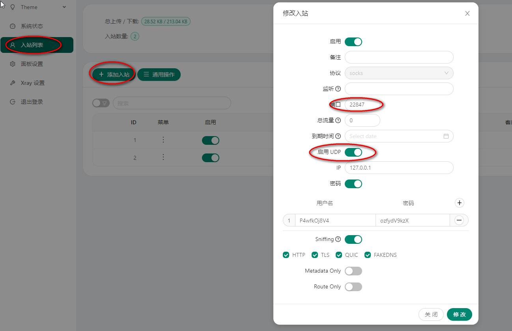
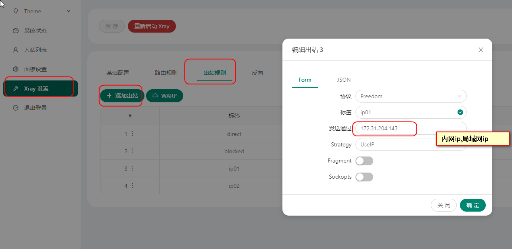
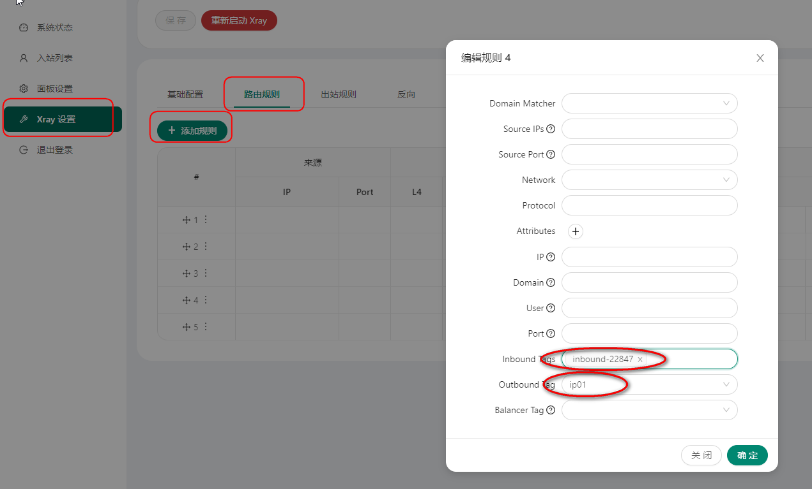
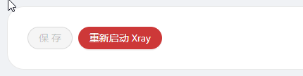
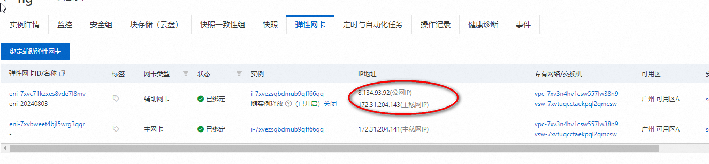
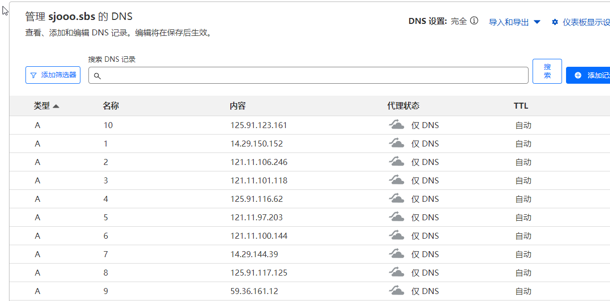

# 3x-ui多ip配置

## 服务器路径

```
/usr/local/x-ui
```

## 入站创建账号



## 出站配置



## 路由规则



## 保存和重启



## 公网ip和私网ip端口要对应



### 如何绑定了域名就用域名登陆账号



```
域名或ip 1.sjooo.sbs
端口 22847
账号 P4wfkOj8V4
密码 ozfydV9kzX
```

