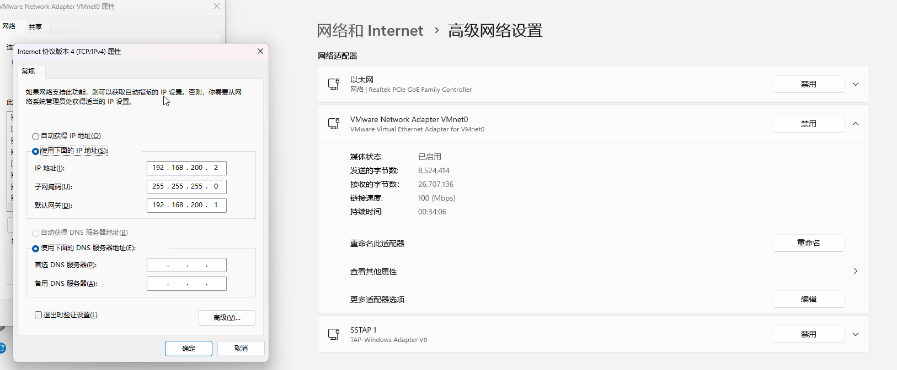
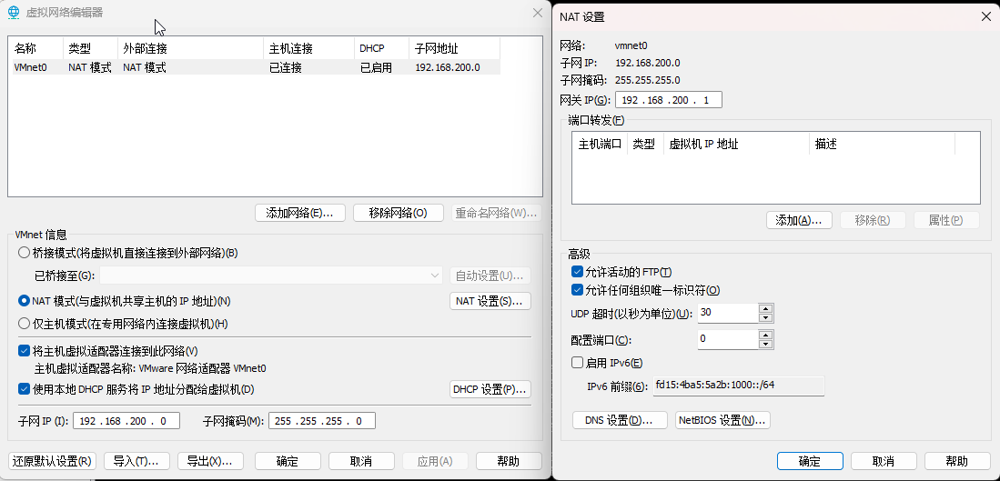

## 1.更新包管理器

```
sudo yum update
sudo yum install libstdc++.i686
sudo yum install glibc.i686
sudo yum install libgcc.i686
sudo yum install zlib.i686
sudo yum install libstdc++.i686 glibc.i686 libgcc.i686 zlib.i686

sudo ln -s /lib/ld-linux.so.2 /lib64/ld-linux.so.2
ls -l /lib/ld-linux.so.2
ls -l /lib64/ld-linux.so.2
```

## 网关文件

### 网关名

```
ifcfg-eth0
```

### 路径

```
/etc/sysconfig/network-scripts/ifcfg-eth0
```

### 编辑

```
vi /etc/sysconfig/network-scripts/ifcfg-eth0
```

```
DEVICE=eth0
BOOTPROTO=static
HWADDR=00:0C:29:57:BC:B0
IPADDR=192.168.200.100
IPV6INIT=yes
IPV6_AUTOCONF=yes
NETMASK=255.255.255.0
GATEWAY=192.168.200.1
ONBOOT=yes
DNS1=8.8.8.8
```

## windows



