# ESXI虚拟机证书

## github

### 软件https://github.com/FiloSottile/mkcert/releases/

 [10years.zip](assets\10years.zip) 

### exsi虚拟机的ip

```
mkcert_10years.exe 192.168.200.100
8.134.148.228
mkcert_10years.exe -install
```

## 启动SSH

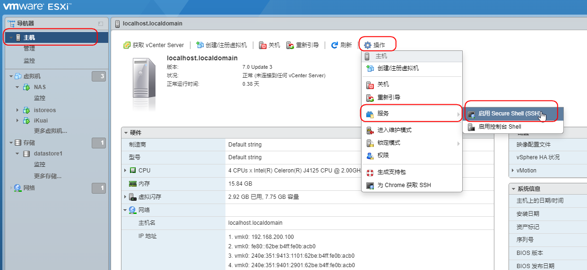

## 连接SSH,上传

### 重命名

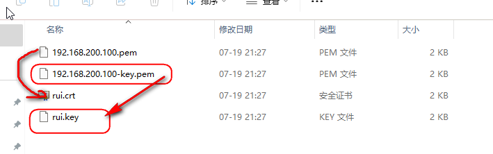

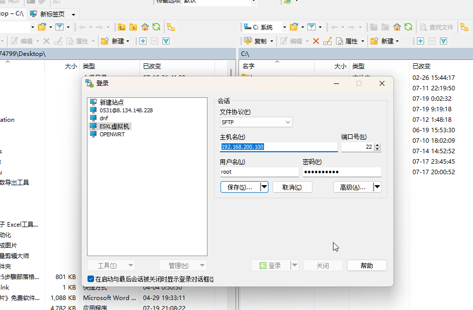

## 路径

```
/etc/vmware/ssl
```


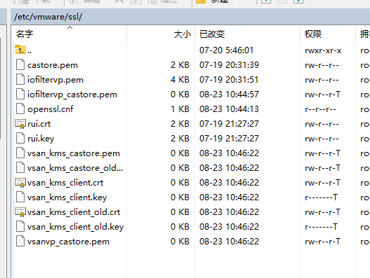

### 覆盖两个rui文件

## CMD重启服务

```
/etc/init.d/hostd restart
/etc/init.d/vpxa restart
```

### 电脑->搜索 证书

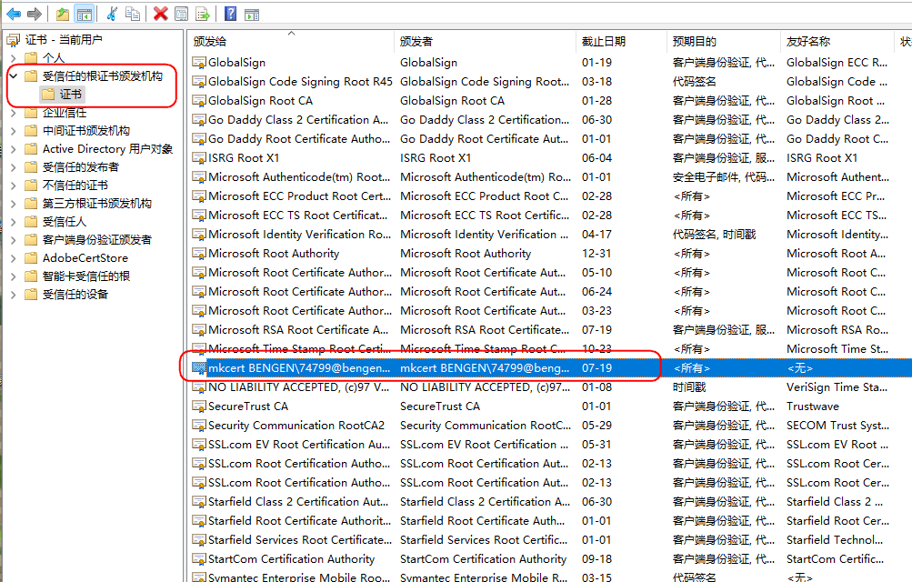

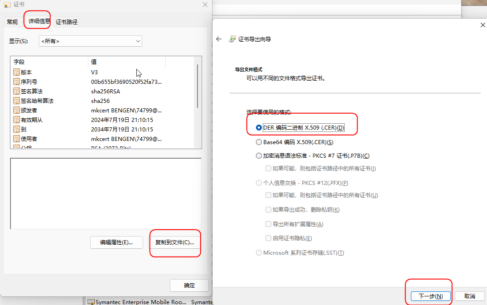

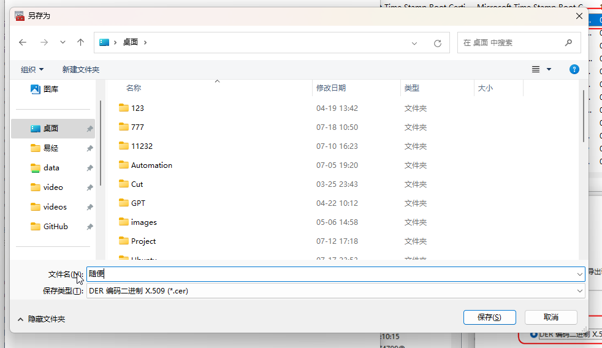

## 关闭浏览器,重新打开esxi

### HTTPS协议

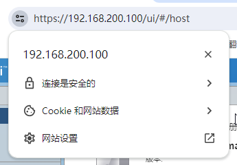


## Ikuai证书

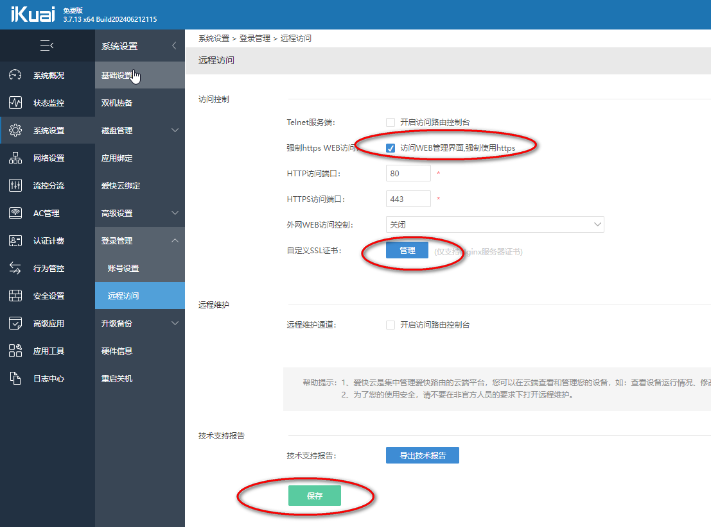

## openwrt证书

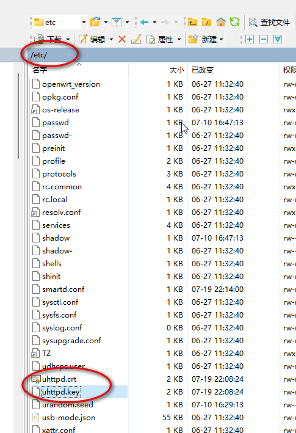

## nas证书

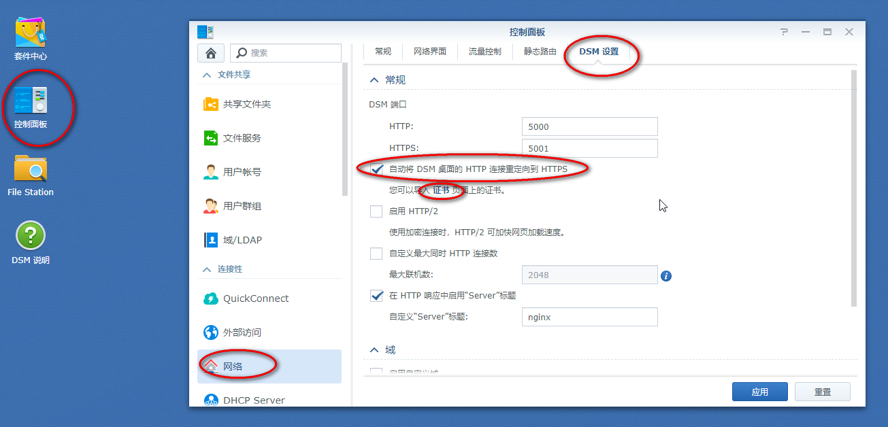

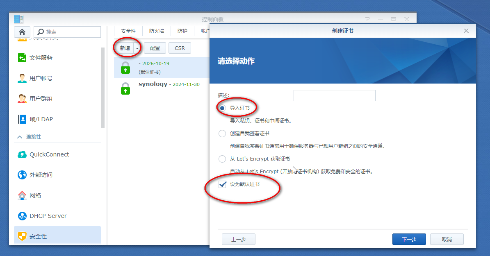