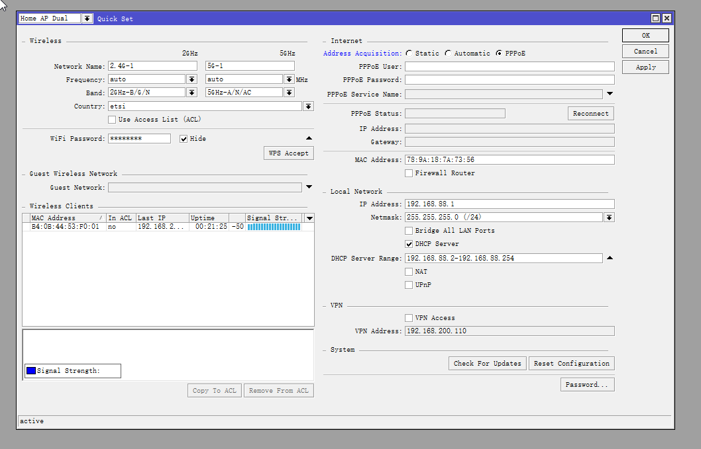
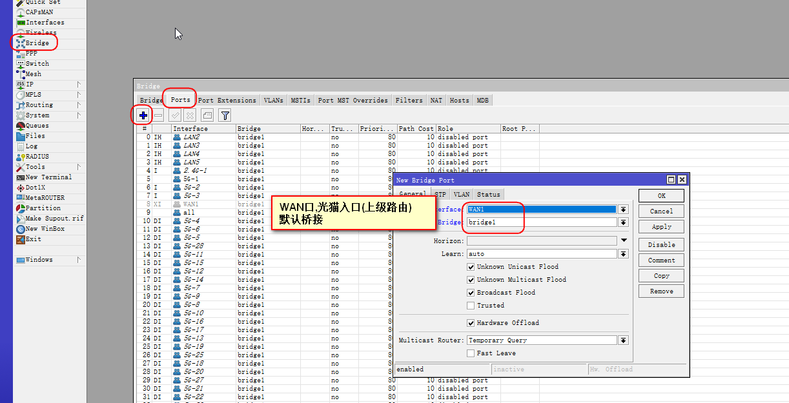

# RouterOS配置

## 重置系统操作

### 断电->按住按钮->通电->直到灯闪烁才成功


## 查看型号

https://mikrotik.com/products

## 打开winbox

https://mikrotik.com/download


### 密码空

### 可设置密码


## 先清除默认配置


## DHCP连接


## 类似光猫,PPPOE拨号(DHCP二选一)



## 主要核对端口和重命名


## 创建wifi密码


## 创建wifi

### mode要选 ap bridge(ap桥接)


## 创建桥接


## 通网自动桥接



### 创建后,进行关闭,不想和lan口串联


### 一次性获取全部接口或wifi,如果个别定制,请先创建,然后再all.因为all后,不允许更改.


## 创建代理IP


## 创建网关


## 获取上游(光猫)IP


## 创建IP池


## 自动分配IP


### 广播网络


## 添加DNS


## 设置防火墙


## IP线路


## 最安全,只能本地winbox.exe连接设置ROS系统


### 其他都关掉

## IP分流代理

### Linux运行

```
curl -s https://raw.githubusercontent.com/17mon/china_ip_list/master/china_ip_list.txt |sed -e 's/^/add address=/g' -e 's/$/ list=CNIP/g'|sed -e $'1i\\\n/ip firewall address-list' -e $'1i\\\nremove [/ip firewall address-list find list=CNIP]' -e $'1i\\\nadd address=192.168.88.0/24 list=CNIP comment=private-network'>cnip.rsc
```

### cnip.rsc文件拖入winbox

### CMD终端窗口运行

### 如果ros默认没密码

### 使用终端需要先设置密码,new password输入两次密码

### 再运行

```
import cnip.rsc
```

### 成功返回

```
Script file loaded and executed successfully
```

