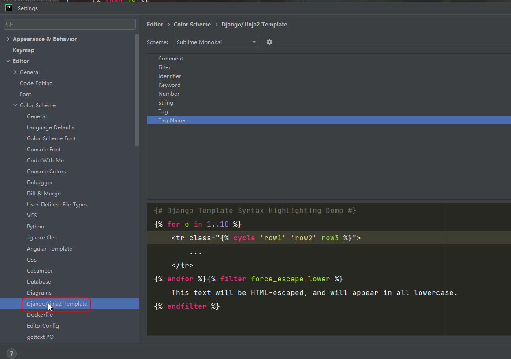

# pycharm主题配置

## Django颜色高亮



## Django代码块


```py

<!DOCTYPE html>
<html lang="en">
<head>
    <meta charset="UTF-8">
    <title>{{ title }}</title>
    <meta name="keywords" content="{{ keywords }}"/>
    <meta name="description" content="{{ description }}"/>
    <meta property="og:url" content=""/>
    <meta property="og:image" content="logo.png"/>
    <meta property="og:site_name" content=""/>
    <meta property="og:title" content=""/>
    <meta property="og:description" content=""/>
    <meta name="generator" content="pycharm"/>
    <meta name="copyright" content="本站版权 Www.bengenseo.com 冰洁个人博客所有 All Rights Reserved"/>
    <link rel="stylesheet" href="{{request.build_absolute_uri}}">
    <link rel="stylesheet" href="{{request.build_absolute_uri}}">
    <link rel="shortcut icon" href="">
    <script src="{{request.build_absolute_uri}}"></script>
    <script src="{{request.build_absolute_uri}}"></script>
    
    
    
</head>
<body>


$END$




</body>
</html>
```

```py





$END$


$END$

$END$


$END$



$END$





$END$


$END$

去除html空白符
$END$




$END$



{{request.build_absolute_uri}}
```

```py











$END$











```

## HTML颜色高亮

