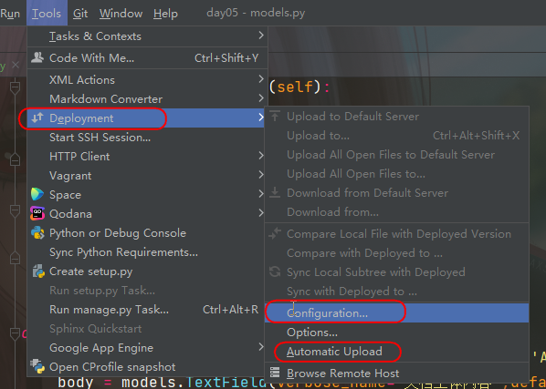

# Pycharm连接Docker


## 手动

- 路径/etc/docker/daemon.json

  ```json
  {
    "registry-mirrors": [
        "https://idsc5w8g.mirror.aliyuncs.com",
        "https://docker.mirrors.ustc.edu.cn",
        "https://registry.docker-cn.com",
        "https://hub-mirror.c.163.com",
        "https://mirror.ccs.tencentyun.com",
        "https://reg-mirror.qiniu.com"
                        ]
  }
  ```

  - 重启docker

    ```
    systemctl daemon-reload
    systemctl restart docker
    ```

## 指令

```
sudo mkdir -p /etc/docker
```

```
sudo tee /etc/docker/daemon.json <<-'EOF'
{
  "registry-mirrors": [
    "https://t57hdrx1.mirror.aliyuncs.com",
    "http://f1361db2.m.daocloud.io"
  ]
}
EOF
```

```
systemctl daemon-reload
systemctl restart docker
```


## 修改TAG版本

```
docker tag nginx:latest nginx:v1.0
```


## 更新

```
yum update
```

## 配置SSH

- 路径/etc/ssh/sshd_config

  ```
  #开启账号密码登陆
  PermitRootLogin yes
  ```

- 命令,修改密码

  ```
  passwd root
  ```

  密码root

- 重启SSH

  ```
  service sshd start
  ```

- 本地windows电脑测试

  - cmd.exe

  ```
  ssh root@192.168.200.100
  ```

  
  
  


