# 百度云盘加速的方法

## PC下载任何手机模拟器

### 比如:雷电模拟器

雷电模拟器是安装电脑上 [ldplayer9_ld_999_ld.exe](assets\ldplayer9_ld_999_ld.exe) 

百度可以在模拟器下载

文件管理器链接 https://mt2.cn/download/

### 由于文件大不好上传github,自行去网站下载

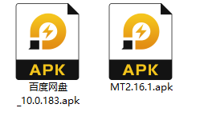

模拟器自动识别安卓文件apk,直接点击就可以安装

## 直接搜索下载

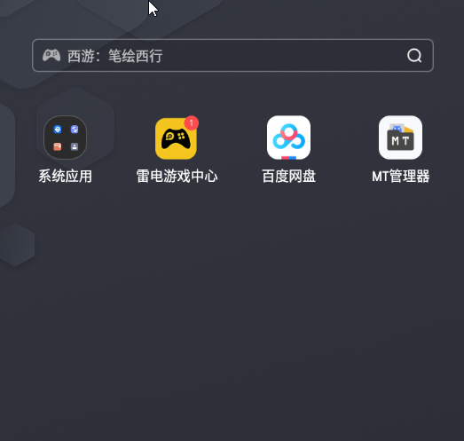

## 下载文件

### 任何文件都可以添加后缀".apk"

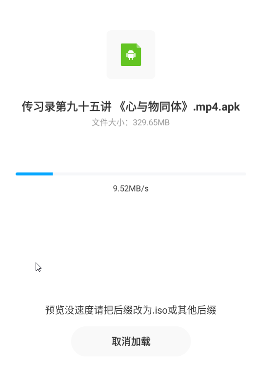

## 百度网盘,对准文件,点击就行(缓存有加速效果)

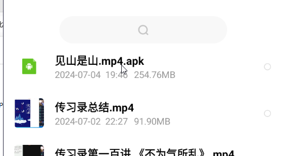

## 如果是以下操作下载,都是龟速

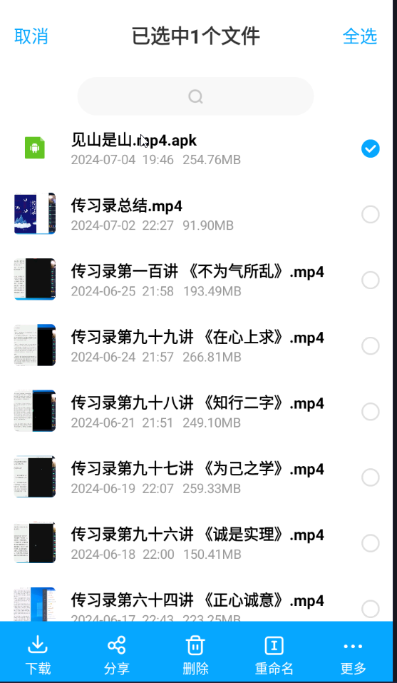

## 缓存路径

```
Android/data/com.baidu.netdisk/缓存/在线预览
```

### 多出来的文件夹就是对应网盘的文件夹


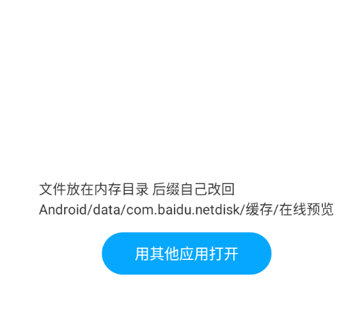

## 电脑和模拟器互通

### 左边是电脑文件路径,右边是手机路径

## 模拟器MT文件管理器界面

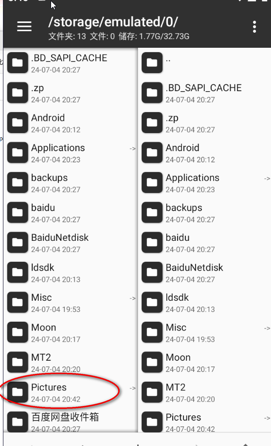

## 选中文件,长按左键,然后复制

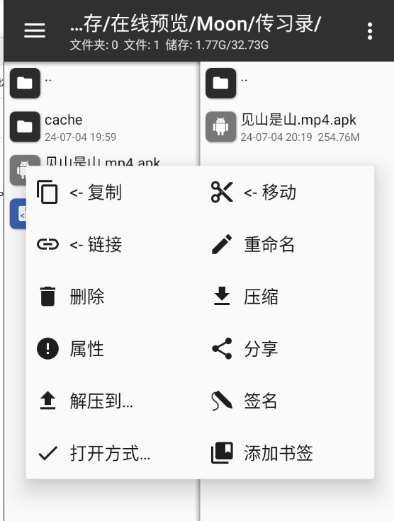

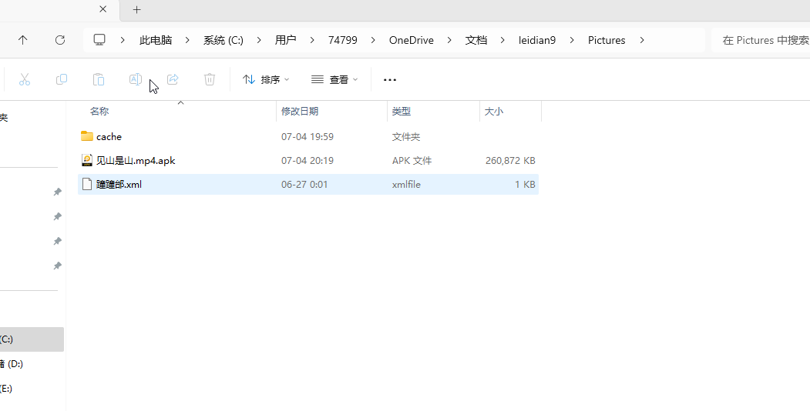
左边是这个文件夹点击进去[leidian9\Pictures]

```
电脑路径,74799是我电脑名
C:\Users\74799\OneDrive\Documents\leidian9\Pictures
```

## 用户就是Users

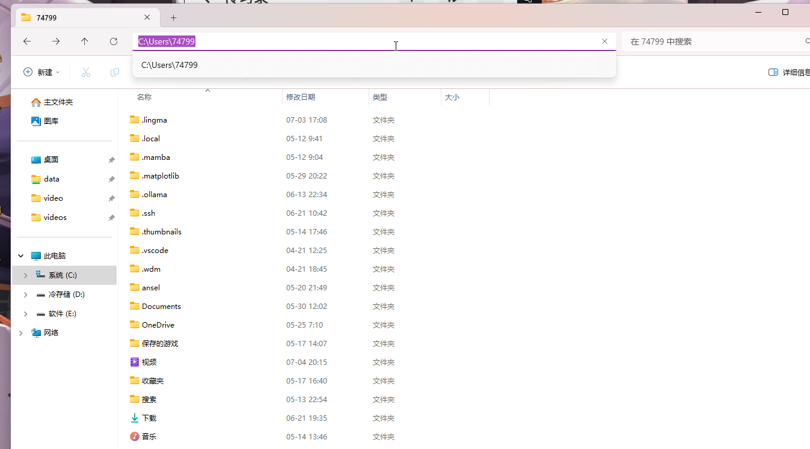

## 输入最后一个文件夹名

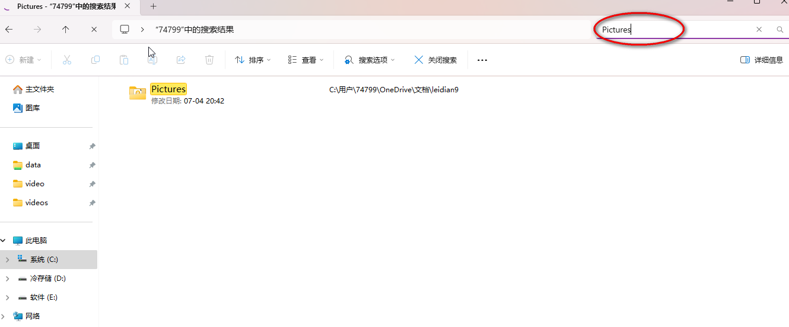

## 最后自己删除".apk"

### 关掉模拟器才可以在电脑上重命名

### 或者

### 在模拟器里重命名都行